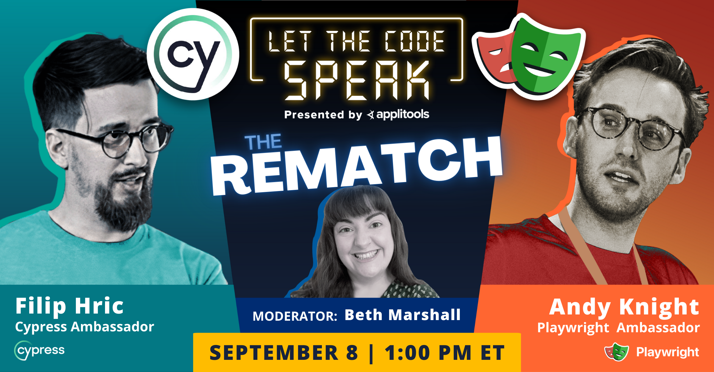

# Cypress vs. Playwright: The Rematch

This repository holds the code for the Applitools webinar,
[Cypress vs. Playwright: The Rematch](https://applitools.com/cypress-vs-playwright-rematch-webinar/)!


## The battle

DING DING DING! It’s time for a colossal rematch between two of the hottest testing frameworks of 2022!
[Back in May](https://applitools.com/event/cypress-versus-playwright-let-the-code-speak/),
Cypress and Playwright squared off in an epic 10-round code battle where the audience judged the winner.
Playwright arose victorious, winning seven of the rounds – but with some very slim margins.

Now, it’s time to jump back into the ring!
[Filip Hric](https://twitter.com/filip_hric) will once again represent Cypress,
and [Andy Knight](https://twitter.com/AutomationPanda) will return to defend Playwright’s champion title.
In this rematch, Filip and Andy will go deeper than small coding snippets:
they will go head-to-head with full test automation projects covering a live web app,
competing for your votes judging which does it better.
And the faceoff will be moderated by none other than [Beth Marshall](https://twitter.com/Beth_AskHer),
the impartial but oh-so-inquisitive quality champion.

Will new features in Cypress 10 steal the thunder?
Will Playwright’s test generation and tracing abilities send a final KO?
Join us live on September 8 for the showdown of the year!

## Trello clone app
Bundled within the repo is an app that is a clone of a popular [Trello app](https://trello.com). You can create boards, lists and cards. You can drag and drop cards between tests or even upload a picture to the card detail. There’s also a very simple signup and login which will allow you to create private boards

### Installation
Super simple
1. `npm install`
2. `npm start`
3. Open your browser on `http://localhost:3000`

### Database
The application uses a json file for a database which you can find in `trelloapp/backend/data/database.json`. Uploaded files are in `trelloapp/backend/data/uploaded` folder.

### Application utilities
By typing `F2` key in the application, a small toolset appears that will allow you to reset your application to a desired state. You can delete boards, lists, cards, users or everything. This is useful when playing with the application manually.


## The Cypress code

The Cypress example code is located under the [`cypress`](cypress) directory.
To run the tests:

```
$ npm install
$ npx cypress run
```

You can also use scripts defined in `cypress/package.json` file with `npm run <script-name>` command. These enable you to run different reporters, browser, subset of tests or run code coverage reports.

You can also take a look at the Cypress dashboard that is [publicly available for this project](https://dashboard.cypress.io/projects/xp9to9/runs).

## The Playwright code

The Playwright example code is located under the [`playwright`](playwright) directory.
To run the tests:

```
$ npm install
$ npx playwright install
$ npx playwright run
```